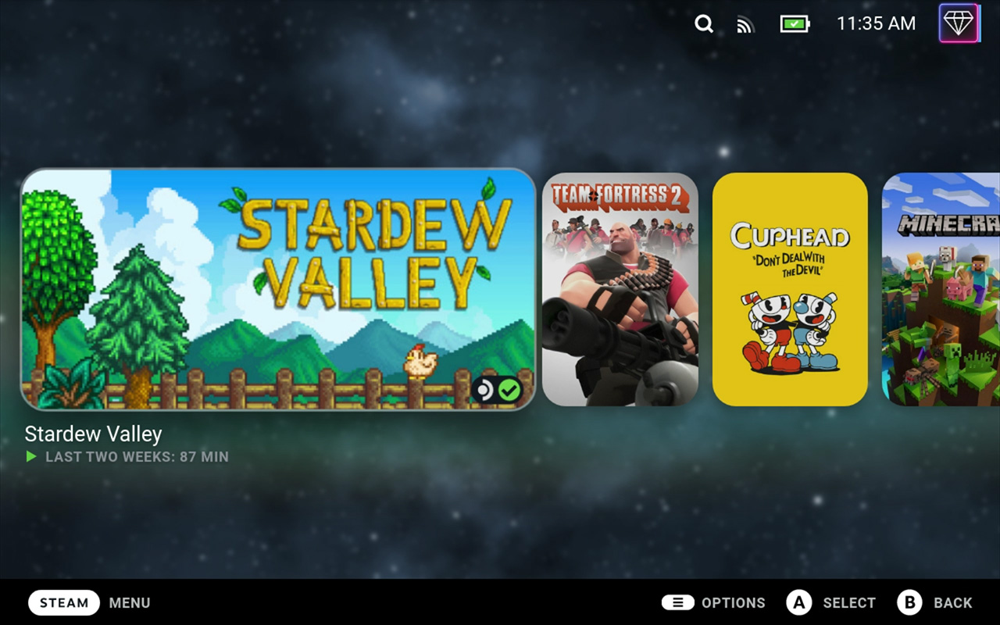
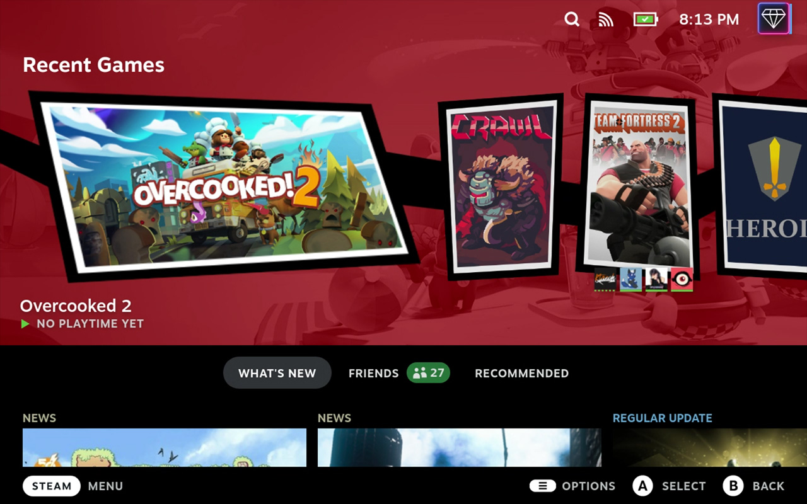
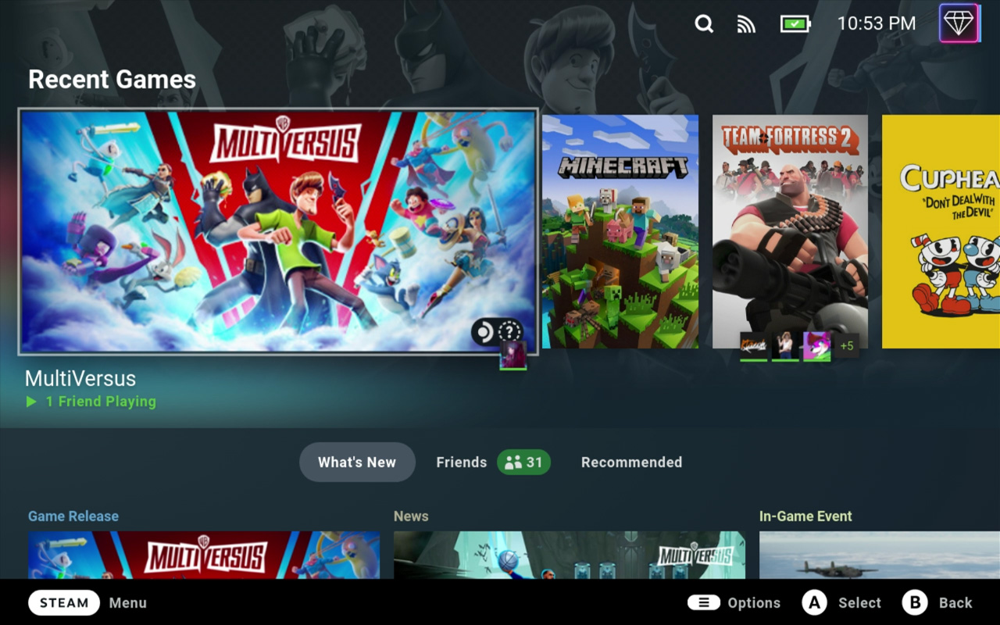
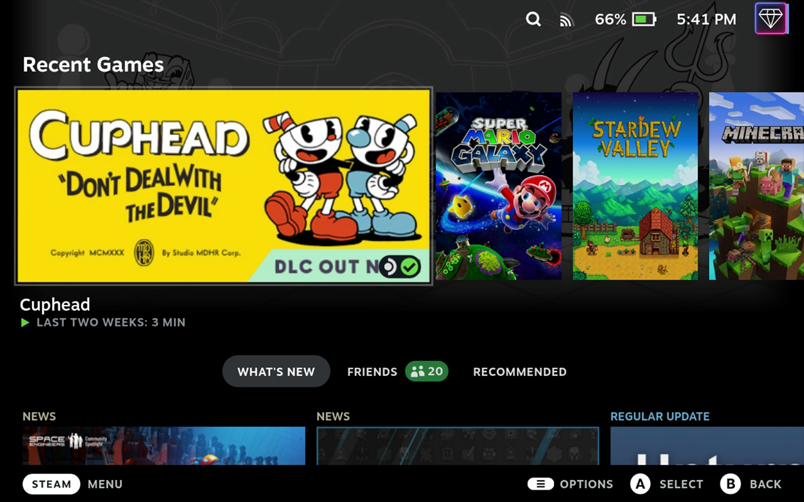
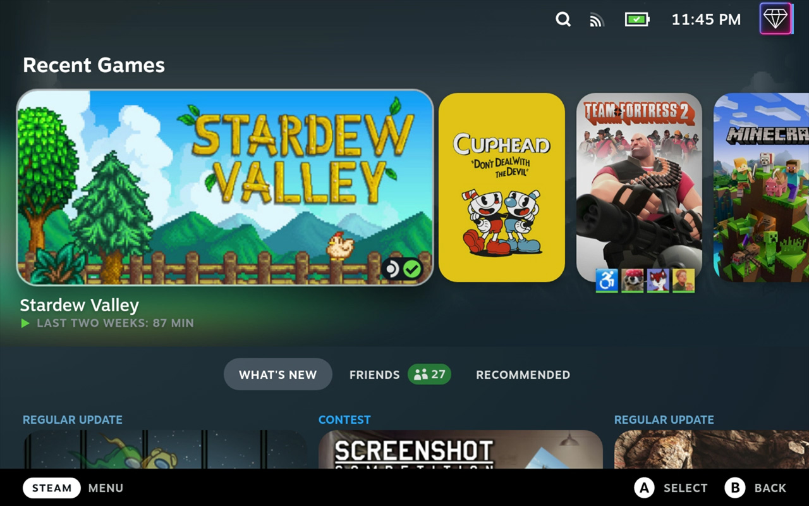

# Steam Deck Themes

This repository contains various themes that I created for use with [suchmememanyskill's Steam Deck CSS loader](https://github.com/suchmememanyskill/SDH-CssLoader). Many of these themes are smaller components that can be built upon, such as a centered home screen. Please feel free to use my work as a part of your own themes. Attribution is always appreciated but not required.

## Installation

1. Install the [Steam Deck plugin loader](https://github.com/SteamDeckHomebrew/decky-loader). The pre-release is recommended at the time of this guide being written.
1. Open the Plugins section in the Quick Access menu.
1. Open the [Plugin Store](https://beta.deckbrew.xyz/) using the shopping bag icon in the top-right corner.
1. Install the [CSS Loader plugin](https://github.com/suchmememanyskill/SDH-CssLoader).
1. Choose a theme installation method below.

### Using the Theme Manager

1. Open the Plugins section in the Quick Access menu.
1. Open the CSS Loader plugin.
1. Select Manage Themes.
1. Find the theme(s) you want to install.
1. Select View Details.
1. Select Install.
1. Return to the CSS Loader plugin.
1. Enable your desired theme(s).

### Manually Adding Themes

1. Hold the power button and select Switch to Desktop.
1. Download this repository.
1. Open a file browser.
1. Navigate to `/home/deck/homebrew/themes`.
1. Copy the desired folder(s) from this repository (ex. `Obsidian`) into the `themes` folder. You do not need to copy the `resources` folder.
1. Select Return to Gaming Mode on the desktop.
1. Open the Plugins section in the Quick Access menu.
1. Open the CSS Loader plugin.
1. Enable your installed theme(s).

## Detailed Themes

Below are previews and brief descriptions for each detailed theme. These are larger themes that contain a variety of changes to overhaul the Steam Deck interface.

### Galactic

This theme is intended to be a rounded, clean, and modern look while still providing eye candy when looking at the recent games. This was my first theme pack and my
first attempt at learning a variety of new CSS changes such as fonts and backgrounds that work on the go.

### Phantom

Join The Phantom Thieves of Hearts with this theme that stylizes your recent games and library to look like the UI from Persona 5. Obsidian is recommended to be used
alongside this theme.

## Themes

Below are previews and brief descriptions for each theme. These are generally smaller themes that are meant to be combined with other themes or used on their own to
provide minimal changes to the Steam Deck interface.

### Centered Home

This theme makes the recent games section take up the full screen and centers it vertically. Options are provided for hiding and showing the header as well as whether
or not to consider the title of the game when centering vertically (assuming the header is hidden). I recommend using this with the Static Background theme by SuchMeme
pictured below.

### Fonts

This theme adds a variety of fonts and control over capitalization to the Steam Deck. Fonts used in any of my other themes as well as certain unique fonts are available
through this theme. Fonts is not accepting new fonts unless they have a reasonable basis (ex. accessibility improvements). Pictured below is Roboto with standard capitalization enforced.

### Obsidian

This theme is based off of pure black themes commonly created for AMOLED devices. Although the Steam Deck has an LCD screen, I find the darker colors easier on my eyes
and less Steam-themed. There are also options for dark gray, gray, and dark variants of all colors of the rainbow.

### Round

This theme adds round edges to any image that can reasonably have them. Certain images like achievements, trading cards, and profile pictures have been left as-is to
avoid removing any detail. Anything largely rectangular or difficult to round (ex. sets of buttons, chat, header) has also been left as-is.

## Contribution

If you want to contribute to my themes, please create an issue first and only do so to fix missing style changes. Make sure to specify in your pull request what I
missed and include screenshots of how you fixed it. I greatly appreciate any help in refining my themes.
